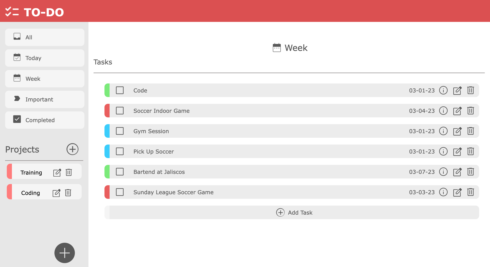

# The Odin Project JavaScript

## Project: Todo List

A dynamically created _ToDo_ list with **vanilla JavaScript, HTML, & Css**.
The project is from The Odin Project [curriculum](https://www.theodinproject.com/paths/full-stack-javascript/courses/javascript/lessons/todo-list).

🔗 **Live preview** of the project is [here](https://azaelreyes.github.io/to-do/).

### Overview

#### **Features:**

- You can **add**, **delete** and **edit** projects and tasks.
- You can write **description** for the task, choose its **date** and **priority**.
- You can **view** information of the task.
- You can see **from which project** is the task, while watching its information.
- You can filter tasks**done for today** or **within a week**.
- You can **check** & **uncheck** tasks as completed.
- You can filter what tasks are **important** and already **completed**.
- You can **store your data** to `localStorage`.

#### **Tools:**

- Visual Studio Code
- Linux terminal
- Git and GitHub
- Webpack Module Bundler
- Prettier Code Formatter

#### **Third party code:**

- [Google Fonts](https://fonts.google.com/)
- [Font Awesome Icons](https://fontawesome.com/)
- [date-fns Library](https://date-fns.org/)

